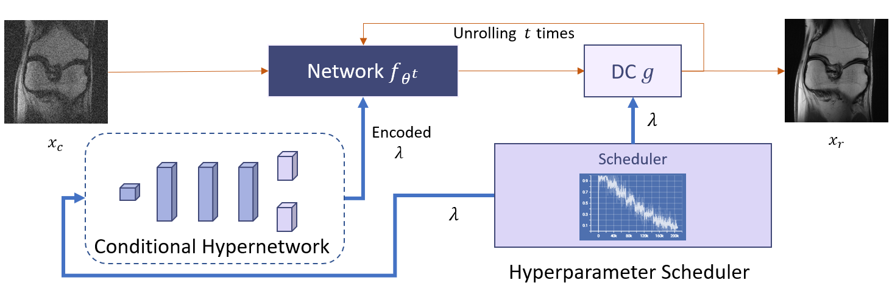

<div align="center">

# Inference Stage Denoising for Undersampled MRI Reconstruction

[](https://arxiv.org/abs/)
[](https://opensource.org/licenses/MIT)
[]((https://biomedicalimaging.org/2024/))

</div>
<table align="center">
  <tr>
    <td align="center"> 
       
      <br>
      <em style="font-size: 18px;">  <strong style="font-size: 18px;">Figure 1:</strong> Overview of the training process. The orange arrows indicate the data flow. The scheduler samples various λ during training, and the thick blue arrows show λ’s involvement.</em>
    </td>
  </tr>
</table>

This is the official code repository for the ISBI 2024 paper [Inference Stage Denoising for Undersampled MRI Reconstruction](https://arxiv.org/abs/).
## Abstract
Reconstruction of magnetic resonance imaging (MRI) data has been positively affected by deep learning. A key challenge remains: to improve generalisation to distribution shifts between the training and testing data. Most approaches aim to address this via inductive design or data augmentation. However, they can be affected by misleading data, e.g. random noise, and cases where the inference stage data do not match assumptions in the modelled shifts. In this work, by employing a conditional hyperparameter network, we eliminate the need of augmentation, yet maintain robust performance under various levels of Gaussian noise.
We demonstrate that our model withstands various input noise levels while producing high-definition reconstructions during the test stage. Moreover, we present a hyperparameter sampling strategy that accelerates the convergence of training. Our proposed method achieves the highest accuracy and image quality in all settings compared to baseline methods.

## Requirements
- Python 3.9+
- PyTorch 1.9.0+
- CUDA 11.1+
- PyTorch Lightning 1.13.0+

## Code Structure
The source code is organized as follows:

```data```: contains FastMRI data related operations.

```Dataset```: contains the specific location for the dataset.

```models```: contains the `nn.Module` class for PyTorch models. 

```pl_modules```: contains the `LightningModule` encapsulation for models. 

```utils```: contains the utilities. 

## Commands

### Training

#### Train the unet model
```bash
python train_unet.py
```

#### Train the unet model in complex
```bash
python train_unet_comp.py
```

#### Train the DIDN model
```bash
python train_DIDN.py
```

#### Train the Cond-DIDN model
```bash
python train_Cond_DIDN.py
```

### Testing

#### Test the unet model
```bash
python test_unet.py
```

#### Test the unet model in complex
```bash
python test_unet_comp.py
```

#### Test the DIDN model
```bash
python test_DIDN.py
```

#### Test the Cond-DIDN model
```bash
python test_Cond_DIDN.py
```

## BibTeX
If you find this repository or the ideas presented in our paper useful, please consider citing.
```
@article{xue2024inference,
  title={Inference Stage Denoising for Undersampled MRI Reconstruction},
  author={Yuyang, Xue., Chen, Qin and Sotirios A. Tsaftaris},
  journal={ISBI},
  year={2024}
}
```
